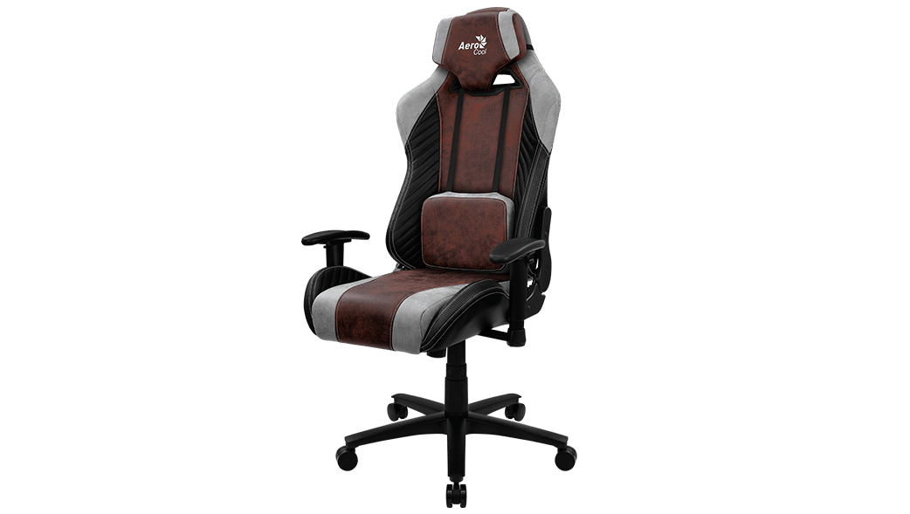



Aerocool Baron Burgundy Red — класичне ігрове крісло з ергономічною спинкою та підтримкою попереку. Регульовані підлокітники та висота сидіння створюють комфорт для тривалих ігрових та офісних сесій. Преміальна оббивка та міцні матеріали забезпечують довговічність. Baron поєднує стиль, здоров’я спини та комфорт, роблячи його ідеальним вибором для геймерів, стрімерів та офісних працівників, які проводять багато часу за комп’ютером.

